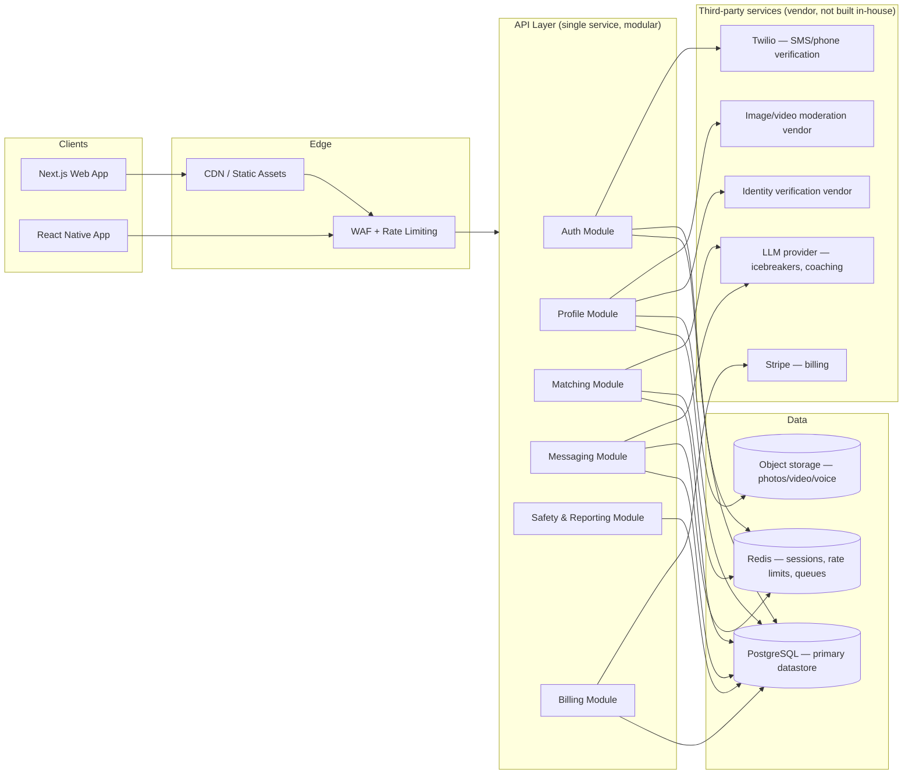

# Ember — System Architecture

**Status:** Partially built. Phase 1 (auth, RBAC, profiles, matching, messaging, safety
foundation) is implemented in `backend/` and covered by real tests against a real
PostgreSQL database — see `CHANGELOG.md`, `TESTING.md`, and `OPEN_DECISIONS.md` for what's
real versus still planned. Sections below marked "target state" describe what's still
ahead; §1a describes what actually exists today.

**Not legal or security certification.** This document informs engineering decisions. It
does not substitute for review by qualified privacy counsel, a licensed security auditor,
or a PCI-DSS QSA before real user data, payments, or safety-critical features go live.

---

## 1. Current state (frontend)

- One React component (`src/Ember.jsx`), path-routed at `/ember` inside a Vite SPA that
  also serves two unrelated static sites (`src/App.jsx`, `src/Website.jsx`) from the same
  deployment.
- All data is hardcoded in-file (`MATCHES`, `LIKES`, etc.) and all mutations are local
  React state. Refreshing the page resets everything. **The frontend is not yet wired up
  to the backend described below** — that integration hasn't been built.

## 1a. Current state (backend — as of Phase 3: Production Infrastructure)

`backend/` is a real NestJS + PostgreSQL + Prisma service, run and tested locally:

- Authentication, RBAC, Profiles, Matching, Messaging, and the full Safety foundation
  (Reports, Blocks, ModerationCases, append-only AuditLog) are implemented and tested.
- **Divergence from the plan below:** §3's stack table recommends delegating auth to
  Auth0/Clerk. Phase 1 instead built a real self-hosted JWT/Argon2id auth system, because
  no vendor credentials exist in this environment and the instruction was explicit: no
  mock auth, everything must execute locally. See `OPEN_DECISIONS.md` D-01 for the full
  rationale and what would need to be true to migrate to a managed provider later.
- **Two of the "vendor, not built in-house" extension points are now genuinely
  operational, not just interface stubs:** email (real SMTP adapter — any SMTP-speaking
  provider, not a specific one) and object storage (real S3-compatible adapter — real AWS
  S3 or any S3-compatible service). Stripe, Twilio, identity verification, OpenAI/Anthropic,
  push, and analytics remain interface + DI token + a "not configured" adapter, per
  `backend/src/integrations/README.md`.
- **Redis is now real, not deferred**, backing distributed rate limiting, account
  lockout, a token blacklist, and background job queues (BullMQ) — all with an in-memory
  fallback when `REDIS_URL` isn't set, so local dev/CI don't require it.
- **Observability is now real**: structured JSON logging (redacted of
  credentials/tokens), per-request correlation IDs, a Prometheus-format `/metrics`
  endpoint, and Sentry error-tracking wiring (a no-op until `SENTRY_DSN` is set) — see
  `SECURITY_NOTES.md`'s "Logging" section and `PRODUCTION_READINESS.md`.
- **Health checks exist** (`/live`, `/ready`, `/health` — §4 below's "no health-check
  endpoint" gap from Phase 2 is closed), wired into the Dockerfile's `HEALTHCHECK` and the
  reference Kubernetes manifests in `backend/k8s/`.
- **A CI/CD pipeline exists**: `backend-ci.yml` (lint, dependency audit, build, unit +
  e2e tests, Docker build) gates every push; `backend-deploy.yml` builds and pushes a
  tagged image to GHCR and runs migrations on push to `main` — see `RELEASE.md`. The final
  "deploy to a real target" step is a documented placeholder, since no production hosting
  target exists yet (see `DEPLOYMENT.md`) — this workflow doesn't pretend one does.
- Kubernetes/Terraform/Elasticsearch/multi-region remain **deliberately not adopted**
  per §2 below, even though basic K8s manifests now exist in `backend/k8s/` (provided as a
  portability reference per an explicit ask, not a recommendation — see `k8s/README.md`
  and `OPEN_DECISIONS.md` D-13). Nothing in this backend's actual deploy path requires
  Kubernetes; standing up a cluster now would still be exactly the premature complexity
  this document argues against.

Every section below is a proposal to replace what's still a stub (§3's third-party vendor
row for anything besides email/storage, mobile, WAF/CDN, multi-service infra) with
something real, phased so that each step is buildable and verifiable rather than a leap to
full enterprise scale on day one.

## 2. Design principle: don't build for a scale you don't have yet

The brief that prompted this document asks for Kubernetes, Elasticsearch, multi-service
NestJS, and Terraform-managed infrastructure from the start. That's the right stack
*eventually*, but standing up a Kubernetes cluster for zero production users is a common
and expensive architecture mistake — it adds operational surface area (more things to
secure, patch, and monitor) without adding capability. The phasing below front-loads
**safety and privacy correctness** (identity, consent, data minimization, moderation) and
defers **infrastructure complexity** until real load justifies it.

## 3. Target architecture — Phase 1 (MVP)

**Why a single modular API service, not microservices, at this phase:** with zero real
users, splitting into a dozen NestJS services means a dozen things to deploy, monitor, and
secure independently, for no throughput benefit. A single well-modularized service
(Auth / Profiles / Matching / Messaging / Safety / Billing as separate NestJS modules
inside one deployable) gets the same code organization with a tenth of the operational
burden. Split modules into independent services only when a specific one becomes a
scaling or team-ownership bottleneck — not preemptively.

### Stack (Phase 1)

| Layer | Choice | Notes |
|---|---|---|
| Web | Next.js + TypeScript | SSR for SEO on public profile/landing pages, matches existing team stack — **still target state**, current frontend is the unwired React prototype (§1) |
| Mobile | React Native / Expo | Shared logic with web where practical — **still target state** (`ROADMAP.md` Phase 4) |
| API | Node.js + NestJS (single service, modular) | Modules map 1:1 to the domains above — **real**, built in Phase 1 |
| Primary DB | PostgreSQL (managed — RDS or equivalent) | See `DATABASE_SCHEMA.md` — **real** locally; a managed instance is a deployment-target decision, not yet made |
| Cache / queues | Redis (managed) | Sessions, rate limiting, background job queue — **real** as of Phase 3 (`REDIS_URL`), including the fallback in-memory/inline behavior when unset; a *managed* Redis instance is still a deployment-target decision |
| Object storage | S3 (or equivalent) | Photos, video intros, voice notes — never in Postgres — **real** as of Phase 3 for photos (presigned uploads, signed reads, thumbnail pipeline); video/voice notes not yet built |
| Auth | Managed provider (Auth0 / Clerk) rather than hand-rolled | Identity is the single highest-consequence thing to get wrong; don't build it in-house at MVP — **diverged**, see D-01 |
| Payments | Stripe, using Stripe-hosted Checkout/Elements | Keeps raw card data off our servers entirely (PCI SAQ-A scope, not SAQ-D) — **still target state**, `PaymentProvider` is an unconfigured stub |
| Phone/SMS | Twilio | Phone verification, safety alerts — **still target state**, `SmsProvider` is an unconfigured stub |
| Identity verification | Dedicated vendor (e.g. Persona, Onfido, Stripe Identity) | Government-ID + liveness is a regulated, high-stakes capability — buy, don't build — **still target state** |
| Infra | Single managed container platform (e.g. AWS ECS/Fargate, or Vercel + a managed API host) | Defers Kubernetes until there's a concrete scaling reason — **still no real target**; Docker image + basic K8s manifests exist (`backend/k8s/`, provided per D-13, not a recommendation) but nothing is actually deployed anywhere |
| CI/CD | GitHub Actions | Matches existing repo tooling — **real** as of Phase 3 (`backend-ci.yml`, `backend-deploy.yml`) up to the point of an actual hosting target existing |
| Observability | Managed APM (e.g. Datadog) from day one, even at small scale | Cheap insurance; retrofit is painful — **partially real**: structured logging, request IDs, `/metrics`, and Sentry error-tracking wiring exist; no APM vendor's dashboards/tracing are wired up yet |

### Deferred to later phases (see `ROADMAP.md`)

- Kubernetes / Terraform-managed multi-service infrastructure
- Elasticsearch (Postgres full-text + trigram search covers MVP search needs)
- Multi-region deployment
- In-house fraud/bot-scoring model (start with a vendor or a simple rules engine)
- Native mobile (Phase 1 ships responsive web / PWA first)

## 4. Security architecture (Phase 1 baseline — non-negotiable regardless of scale)

- **Transport:** TLS 1.3 everywhere; HSTS; no plaintext fallback.
- **At rest:** Database and object storage encrypted at rest (cloud-provider managed keys
  at MVP; customer-managed keys is a Phase 3+ enterprise item, not a blocker for launch).
- **Passwords:** Delegated to the auth provider (Auth0/Clerk), which handles Argon2id/bcrypt
  hashing — do not hand-roll credential storage.
- **Sessions:** Short-lived JWT access tokens + rotating refresh tokens, revocable server-side.
- **Authorization:** RBAC at the API layer (`user`, `moderator`, `admin`, `support`), enforced
  in a single shared middleware, not per-endpoint ad hoc checks.
- **Secrets:** A managed secrets store (e.g. AWS Secrets Manager / Vercel encrypted env vars),
  never committed to the repo, never in client bundles. `docker-compose.prod.yml` and
  `backend/k8s/secret.example.yaml` show the *shape* every secret takes (env var names) —
  neither contains a real value, and the Kubernetes example is explicitly labeled
  "never apply this file as-is."
- **API layer:** WAF + rate limiting in front of every endpoint; stricter limits on
  auth, messaging, and reporting endpoints specifically (the ones scammers and bots hit hardest).
- **Input handling:** Parameterized queries only (NestJS + an ORM like Prisma/TypeORM by
  default prevents raw SQL injection — enforce via lint rule, don't rely on discipline).
- **Headers:** CSP, `X-Content-Type-Options`, `X-Frame-Options`, `Referrer-Policy` on every response.
- **Audit logging:** Every access to another user's PII, every moderation action, every
  admin action — who, what, when, from where — append-only, not editable by the actor.

## 5. Privacy architecture (Phase 1 baseline)

- **Data minimization:** Collect the minimum needed per feature. Government ID goes to the
  verification vendor, not into our database — we store a verification *result* (pass/fail
  + timestamp + vendor reference ID), never the ID image or number.
- **Consent:** Explicit, logged, timestamped consent for each processing purpose that needs
  it (marketing SMS/email, location sharing, background-check add-on). Consent state is
  queryable per user, not inferred from a single "I agree" checkbox.
- **Retention:** A written retention schedule per data category (see `COMPLIANCE_CHECKLIST.md`)
  with an automated job that enforces it — not a policy that only lives in a document.
- **Right to access / erasure:** A real, automated data-export and account-deletion workflow
  from day one — retrofitting this after launch is far more expensive than building it in.
- **Location:** Precise location is never stored longer than the feature requires it
  (e.g. "Nearby now" visibility window); city-level location is what's shown to other users,
  not exact coordinates.

## 6. Open architectural decisions requiring sign-off before Phase 1 build starts

1. **Launch jurisdiction scope.** Launching US-only first materially reduces compliance
   scope (no GDPR data-transfer mechanics) vs. launching in the EU/UK simultaneously.
   This is a product/legal decision, not an engineering one — make it before schema design,
   since it affects what consent and data-residency fields the schema needs.
2. **Identity verification vendor.** Which vendor, and what the actual bar is (ID + liveness
   only vs. ID + liveness + background-check add-on) affects the `verifications` table shape
   and the cost model.
3. **Age assurance approach.** A dating platform's obligation is to keep minors *off* the
   platform entirely (18+), not to "protect minors" as participants — confirm the intended
   age-gating mechanism (self-attestation vs. ID-based) before building signup.
