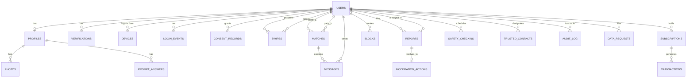

# Ember — Database Schema (Phase 1 target)

**Status:** Planning document — no database exists yet. This is the proposed PostgreSQL
schema for the MVP described in `ARCHITECTURE.md`. Column lists are representative, not
exhaustive; treat as a starting point for migration files, not a final DDL to run as-is.

**PII handling note:** Columns marked 🔒 are sensitive and must never appear in application
logs, error messages, or analytics events. Columns marked 🚫 must **never exist** — the
data they'd hold belongs with a vendor, not in our database (see notes).

---

## 1. Entity-relationship overview

## 2. Core tables

### `users`
Authentication identity is delegated to the auth provider (Auth0/Clerk — see
`ARCHITECTURE.md`); this table holds the app-side user record it maps to.

| Column | Type | Notes |
|---|---|---|
| `id` | uuid, PK | |
| `auth_provider_id` | text, unique | Foreign identity from Auth0/Clerk, not a password |
| `phone` 🔒 | text, unique, encrypted | E.164 format |
| `phone_verified_at` | timestamptz, null | |
| `email` 🔒 | text, unique, encrypted | |
| `email_verified_at` | timestamptz, null | |
| `date_of_birth` 🔒 | date | Used only to compute age + enforce 18+; never shown raw to other users |
| `role` | enum(`user`,`moderator`,`admin`,`support`) | Drives RBAC |
| `status` | enum(`active`,`suspended`,`banned`,`deactivated`,`deleted`) | |
| `created_at` / `updated_at` | timestamptz | |
| `deleted_at` | timestamptz, null | Soft-delete marker; see §5 retention |

🚫 **No password column.** Credential storage is delegated to the auth provider.
🚫 **No raw government-ID number or image.** See `verifications`.

### `profiles`
| Column | Type | Notes |
|---|---|---|
| `user_id` | uuid, PK/FK → users | 1:1 with users |
| `display_name` | text | |
| `bio` | text | |
| `intent` | enum(`casual`,`serious`,`friendship`) | Required at signup per product spec |
| `gender`, `seeking` | enum/array | |
| `city`, `region`, `country` | text | Coarse location shown to others |
| `precise_location` 🔒 | geography(point), null | Only populated while an opt-in, time-boxed feature (e.g. "Nearby now") is active; purged on expiry by a scheduled job, not a manual step |
| `max_distance_mi`, `age_min`, `age_max` | int | Search preferences |
| `verified_badge` | boolean | Derived from `verifications`, not independently settable |
| `visible` | boolean | Supports "hide except mutual likes" (Gold filter feature) |

### `photos`
| Column | Type | Notes |
|---|---|---|
| `id` | uuid, PK | |
| `profile_id` | uuid, FK → profiles | |
| `s3_key` | text | Object storage reference — never the binary in Postgres |
| `moderation_status` | enum(`pending`,`approved`,`rejected`) | Set by the moderation vendor/pipeline before a photo is ever servable to other users |
| `is_primary` | boolean | |
| `blurred_until_match` | boolean | Product feature: photo hidden until mutual match |

### `prompt_answers`
| Column | Type | Notes |
|---|---|---|
| `id` | uuid, PK | |
| `profile_id` | uuid, FK | |
| `prompt_key` | text | References a shared prompt catalog, not free-text duplication |
| `answer` | text | |

### `verifications`
| Column | Type | Notes |
|---|---|---|
| `id` | uuid, PK | |
| `user_id` | uuid, FK | |
| `type` | enum(`phone`,`email`,`id_document`,`liveness`,`background_check`) | |
| `vendor` | text | e.g. `persona`, `onfido`, `stripe_identity` |
| `vendor_reference_id` | text | Pointer into the vendor's system — the vendor holds the document, we hold the receipt |
| `result` | enum(`pass`,`fail`,`pending`,`review`) | |
| `decided_at` | timestamptz | |

🚫 **No ID document image or number.** That lives with the vendor under their own
compliance program; we store only the verdict and a reference ID to look it up if needed
(e.g. for an appeal), per the data-minimization principle in `ARCHITECTURE.md`.

### `devices` / `login_events` (fraud & account-security signals)
| Table | Key columns | Notes |
|---|---|---|
| `devices` | `id`, `user_id`, `fingerprint_hash`, `first_seen_at`, `last_seen_at`, `trusted` | Fingerprint is hashed, not raw device data |
| `login_events` | `id`, `user_id`, `device_id`, `ip_address` 🔒, `ip_risk_score`, `succeeded`, `created_at` | Feeds login-alert notifications and account-takeover detection |

### `swipes` / `matches` / `messages`
| Table | Key columns | Notes |
|---|---|---|
| `swipes` | `id`, `actor_id`, `target_id`, `action` (`like`,`pass`,`super_like`), `created_at` | Append-only |
| `matches` | `id`, `user_a_id`, `user_b_id`, `matched_at`, `unmatched_at` (null) | Created when reciprocal `like` rows exist |
| `messages` | `id`, `match_id`, `sender_id`, `body` 🔒, `kind` (`text`,`voice`,`system`), `media_s3_key`, `sent_at`, `deleted_at` | Voice-note audio in S3, never inline; `deleted_at` supports user-initiated delete without breaking the other party's view contract — define that behavior explicitly, don't leave it implicit |

### `reports` / `blocks` / `moderation_actions` (Trust & Safety)
| Table | Key columns | Notes |
|---|---|---|
| `reports` | `id`, `reporter_id`, `subject_id`, `reason`, `details`, `evidence_s3_keys[]`, `status` (`open`,`in_review`,`resolved`,`dismissed`), `created_at`, `resolved_at` | `reason` is a required enum (harassment, scam, fake profile, underage concern, etc.), not free text only — free text alone makes trend analysis impossible |
| `blocks` | `id`, `blocker_id`, `blocked_id`, `created_at` | Blocking is independent of reporting |
| `moderation_actions` | `id`, `report_id` (nullable — some actions are proactive, not report-driven), `actor_id` (moderator/system), `action` (`warn`,`suspend`,`ban`,`content_remove`,`no_action`), `automated` (bool), `notes`, `created_at` | Every action — human or AI — is logged with which

### `subscriptions` / `transactions`
| Table | Key columns | Notes |
|---|---|---|
| `subscriptions` | `id`, `user_id`, `tier` (`free`,`plus`,`gold`,`black`), `stripe_subscription_id`, `status`, `current_period_end` | Stripe is the source of truth for billing state; this table mirrors it via webhook, never computes it independently |
| `transactions` | `id`, `user_id`, `stripe_payment_intent_id`, `amount_cents`, `currency`, `kind` (`subscription`,`boost`,`super_like`,`id_verification`), `status` | 🚫 no raw card data — Stripe tokenizes it, we only ever see a payment intent ID |

### `safety_checkins` / `trusted_contacts`
| Table | Key columns | Notes |
|---|---|---|
| `trusted_contacts` | `id`, `user_id`, `name`, `phone` 🔒, `relationship` | |
| `safety_checkins` | `id`, `user_id`, `match_id`, `trusted_contact_id`, `share_expires_at`, `last_location` 🔒 (null unless actively sharing), `checked_in_at`, `panic_triggered_at` | `last_location` is purged the moment sharing ends, not retained "for history" |

### `consent_records` / `data_requests` (privacy operations)
| Table | Key columns | Notes |
|---|---|---|
| `consent_records` | `id`, `user_id`, `purpose` (`marketing_sms`,`marketing_email`,`location_sharing`,`background_check`), `granted`, `granted_at`, `revoked_at` | Per-purpose, queryable — not a single boolean |
| `data_requests` | `id`, `user_id`, `type` (`export`,`erasure`), `status`, `requested_at`, `fulfilled_at` | Drives the automated right-to-access/erasure workflow, not a support-ticket manual process |

### `audit_log`
| Column | Type | Notes |
|---|---|---|
| `id` | uuid, PK | |
| `actor_id` | uuid, null if system | |
| `action` | text | e.g. `profile.view_pii`, `moderation.ban_user`, `admin.role_change` |
| `subject_id` | uuid, null | The user/record acted upon |
| `metadata` | jsonb | Structured detail — never raw PII inline; reference IDs instead |
| `created_at` | timestamptz | |

Append-only at the database level (no `UPDATE`/`DELETE` grants on this table for any
application role) — an audit log that the same system can silently edit isn't one.

## 3. Indexing notes (not exhaustive)

- `profiles`: composite index on `(seeking, city, age constraints)` for match-candidate queries.
- `messages`: index on `(match_id, sent_at)` for chat pagination.
- `reports`: index on `(status, created_at)` for the moderation queue.
- `login_events`: index on `(user_id, created_at)` and `(ip_address, created_at)` for
  anomaly-detection queries.

Full-text/trigram search on `profiles.bio` and `prompt_answers.answer` via Postgres
`pg_trgm` covers MVP search needs — defer Elasticsearch until query patterns actually
outgrow it (see `ARCHITECTURE.md` §2).

## 4. Encryption approach

- 🔒 columns (phone, email, precise location, message body, trusted-contact phone) use
  column-level encryption or a transparent encrypting proxy, in addition to disk-level
  encryption at rest — so a database dump or backup leak doesn't expose them in plaintext.
- Encryption keys are managed via the cloud provider's KMS, not embedded in application config.

## 5. Retention (maps to `COMPLIANCE_CHECKLIST.md`)

- `login_events`, `devices`: rolling retention (e.g. 12 months), then purged.
- `safety_checkins.last_location`: purged immediately on share expiry, not retained.
- `reports` / `moderation_actions`: retained longer (legal/appeals need), with PII fields
  redacted after the case is closed and the appeal window lapses.
- On account deletion: hard-delete PII columns; retain non-identifying aggregate/financial
  records only as long as tax/legal obligations require, with the user reference replaced
  by a tombstone ID.
