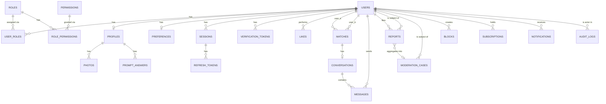

# Ember — Database Schema

**Status:** This document describes the real, running schema. It was originally written as
a pre-implementation plan (see git history for that version) and described a
vendor-delegated identity model (Auth0/Clerk) that was never built — Phase 1 built
self-hosted JWT + Argon2id auth instead (see `ARCHITECTURE.md` §1a and `OPEN_DECISIONS.md`
D-01). This rewrite (RC-1) replaces that plan with an accurate description of
`backend/prisma/schema.prisma`, which remains the single source of truth for exact column
names/types/constraints — treat any conflict between this file and `schema.prisma` as a bug
in this file, and check `schema.prisma` directly.

**PII handling note:** Columns marked 🔒 are sensitive and must never appear in application
logs, error messages, or analytics events — see `docs/ember/LOGGING_AUDIT.md` for the
verified state of that claim. Columns marked 🚫 don't exist in this schema by design — the
data they'd hold either belongs with a vendor, not our database, or the feature doesn't
exist yet (noted per-table).

---

## 1. Entity-relationship overview (matches `schema.prisma`)

Not represented above and **not built**: identity-verification records, device/login-event
tables, safety check-ins, trusted contacts, consent records, and data-export/erasure
request tracking. These were part of the original pre-implementation plan and remain real
product needs (see `ROADMAP.md`), but no Prisma model exists for any of them today — do not
assume they're implemented. New-device login detection, which *is* built, works differently
than a dedicated `devices` table (see §2 `sessions` below).

## 2. Core tables

### `users`
Self-hosted credential storage — see `ARCHITECTURE.md` §1a. No vendor identity delegation.

| Column | Type | Notes |
|---|---|---|
| `id` | uuid, PK | |
| `email` 🔒 | text, unique | Normalized (lowercased/trimmed) at the application layer before every read/write — see `SECURITY_NOTES.md`. |
| `phone` 🔒 | text, unique, nullable | E.164 format, validated at the DTO layer (`@IsPhoneNumber`). |
| `passwordHash` 🔒 | text | Argon2id, via the `argon2` package's default parameters. Never selected into any API response — `UsersService` uses an explicit Prisma `select` that omits it. |
| `dateOfBirth` 🔒 | date, nullable | Used only to compute age + enforce the platform minimum; never returned raw in any profile-facing response. |
| `emailVerifiedAt` / `phoneVerifiedAt` | timestamptz, nullable | |
| `status` | enum: `ACTIVE`, `SUSPENDED`, `BANNED`, `DEACTIVATED` | No `DELETED` value — deletion is represented by `deletedAt` being non-null, not a status. Checked live on every authenticated request (`JwtStrategy.validate()`), not just at token-issue time. |
| `createdAt` / `updatedAt` | timestamptz | |
| `deletedAt` | timestamptz, nullable | Soft-delete marker. |

🚫 No `auth_provider_id` column — there is no vendor identity delegation in this build.
🚫 No ID-verification document/number column — no identity-verification feature is built at
all yet (`IDENTITY_VERIFICATION_PROVIDER` remains a `NotConfigured*` stub — see
`OPEN_DECISIONS.md`).

**RBAC is not a column on `users`.** It's four join tables: `roles`, `permissions`,
`role_permissions` (many-to-many between roles and permissions), and `user_roles`
(many-to-many between users and roles, with `assignedAt`). `PermissionsGuard` checks a
user's live, current role/permission grants against the database on every guarded request —
never trusted from a JWT claim. Seeded roles: `user`, `moderator`, `admin`, `support`
(4 roles, 8 permissions — see `prisma/seed.ts`).

### `sessions` / `refresh_tokens` / `verification_tokens`
| Table | Key columns | Notes |
|---|---|---|
| `sessions` | `id`, `userId`, `deviceFingerprint`, `ipAddress`, `userAgent`, `createdAt`, `lastSeenAt`, `revokedAt` | One row per login. New-device detection (`AuthService.detectAndNotifyNewDevice()`) queries this table for a matching fingerprint/IP rather than a separate `devices` table — there isn't one. |
| `refresh_tokens` | `id`, `sessionId`, `userId`, `tokenHash` (unique), `expiresAt`, `revokedAt`, `replacedByTokenHash` | The raw refresh token is never stored — only `SHA-256(rawToken)`. Rotated on every use; presenting an already-rotated-away token revokes the *entire* session and all its refresh tokens (reuse detection). |
| `verification_tokens` | `id`, `userId`, `purpose` (`EMAIL_VERIFY` \| `PASSWORD_RESET`), `tokenHash` (unique), `expiresAt`, `usedAt` | Same hashed-at-rest pattern as `refresh_tokens`. Single-use, enforced via a check on `usedAt`. |

### `profiles`
| Column | Type | Notes |
|---|---|---|
| `userId` | uuid, PK/FK → users | 1:1 with users. |
| `displayName` | text | |
| `bio` | text, nullable | |
| `intent` | enum, nullable: `CASUAL`, `SERIOUS`, `FRIENDSHIP` | |
| `city`, `region`, `country` | text, nullable | Coarse location only. |
| `verifiedBadge` | boolean | Currently only ever `false` by default — nothing sets it `true` yet, since no identity-verification feature is built to derive it from. |
| `visible` | boolean | |
| `createdAt` / `updatedAt` / `deletedAt` | timestamptz | |

🚫 No `gender`/`seeking` columns on `profiles` — `seekingGenders` lives on `preferences`
(below), not here. 🚫 No `precise_location` column — there is no location-sharing feature
built (the original plan's "Nearby now" concept is not implemented).

### `preferences`
Not present in the original plan at all, despite being a real, documented API
(`GET`/`PUT /profiles/me/preferences`) backing real matching-candidate filtering.

| Column | Type | Notes |
|---|---|---|
| `userId` | uuid, PK/FK → users | 1:1 with users. |
| `ageMin` / `ageMax` | int, default 18/99 | |
| `maxDistanceKm` | int, default 50 | **Kilometers, not miles.** |
| `seekingGenders` | text[] | Free-form list, validated at the application layer rather than a constrained enum — deliberate, see the field's own schema comment. |
| `verifiedOnly` | boolean | |
| `updatedAt` | timestamptz | |

### `photos`
| Column | Type | Notes |
|---|---|---|
| `id` | uuid, PK | |
| `profileId` | uuid, FK → profiles | |
| `storageKey` | text | Provider-agnostic object storage reference (renamed from an earlier `s3Key` to match the `StorageProvider` abstraction, which isn't S3-specific). **Never returned in any client-facing API response** — every read hydrates a short-lived signed URL instead (see `ProfilesService.hydratePhotoUrls` / `MatchingService.hydrateCandidatePhotos`). Registering a photo requires the caller's own userId to prefix the key (`photos/<userId>/...`) — see the RC-1 security fix in `CHANGELOG.md`. |
| `moderationStatus` | enum: `PENDING`, `APPROVED`, `REJECTED` | Set only by a moderator/admin (`setModerationStatus`), never client-settable. New photos always start `PENDING` regardless of what the client sends. |
| `isPrimary` | boolean | Enforced single-primary-per-profile via a partial unique index (`photos_one_primary_per_profile`), not just application logic. |
| `blurredUntilMatch` | boolean | |
| `contentType` / `byteSizeBytes` / `width` / `height` | nullable | Captured from the actual uploaded object at registration time (Phase 3), not trusted from the client. |
| `thumbnailStorageKey` / `thumbnailGeneratedAt` | nullable | Populated asynchronously by the thumbnail pipeline. |
| `createdAt` | timestamptz | |

### `prompt_answers`
| Column | Type | Notes |
|---|---|---|
| `id` | uuid, PK | |
| `profileId` | uuid, FK | |
| `promptKey` | text | Application-defined catalog, not enforced by a DB-level enum/FK. |
| `answer` | text | |

Unique on `(profileId, promptKey)` — one answer per prompt per profile.

### `likes` / `matches` / `conversations` / `messages`
| Table | Key columns | Notes |
|---|---|---|
| `likes` | `id`, `actorId`, `targetId`, `action` (`LIKE`\|`PASS`\|`SUPER_LIKE`), `createdAt` | Unique on `(actorId, targetId)` — one decision per pair; changing your mind updates the row rather than inserting a new one. |
| `matches` | `id`, `userAId`, `userBId`, `matchedAt`, `unmatchedAt` (nullable) | Created transactionally when reciprocal `LIKE`/`SUPER_LIKE` rows exist for both directions of a pair; unique on `(userAId, userBId)` with a canonical ordering so a pair never produces two rows. `unmatchedAt` is a real column but no code path sets it yet — no "unmatch" feature is built (`OPEN_DECISIONS.md` D-06). |
| `conversations` | `id`, `matchId` (unique, FK → matches) | **Messages do not reference `matches` directly** — every match has exactly one conversation, and messages hang off the conversation, not the match. This intermediate table doesn't appear in the original plan. |
| `messages` | `id`, `conversationId`, `senderId` (nullable — null for `SYSTEM` messages), `kind` (`TEXT`\|`VOICE`\|`SYSTEM`), `body`, `mediaStorageKey`, `sentAt`, `deletedAt` | Indexed on `(conversationId, sentAt)` for pagination. |

### `reports` / `blocks` / `moderation_cases` (Trust & Safety)
| Table | Key columns | Notes |
|---|---|---|
| `reports` | `id`, `reporterId`, `subjectId`, `reason` (enum — harassment, scam/fraud, fake profile, underage concern, inappropriate content, off-platform solicitation, other), `details`, `status` (`OPEN`\|`IN_REVIEW`\|`RESOLVED`\|`DISMISSED`), `moderationCaseId` (nullable FK), `createdAt`, `resolvedAt` | `reporterId`/`subjectId` FKs use `onDelete: Restrict`, deliberately — a future account-deletion feature must not be able to silently erase the report trail by deleting the referenced user rows first. |
| `blocks` | `id`, `blockerId`, `blockedId`, `createdAt` | Unique on `(blockerId, blockedId)`; indexed on `blockedId` to support the reverse "who has blocked me" half of every block-aware query. |
| `moderation_cases` | `id`, `subjectId`, `assigneeId` (nullable), `status` (`OPEN`\|`IN_REVIEW`\|`ACTION_TAKEN`\|`DISMISSED`), `action` (`NONE`\|`WARNING`\|`CONTENT_REMOVED`\|`SUSPENDED`\|`BANNED`), `notes`, `automated`, `createdAt`, `resolvedAt` | **Subject-centric, not report-centric** — one case aggregates many `reports` via `reports.moderationCaseId`, the reverse of the original plan's one-action-per-report model. `subjectId` also uses `onDelete: Restrict`, same reasoning as `reports`. |

🚫 No `evidence_s3_keys[]` column on `reports` — evidence attachment isn't built.

### `audit_logs`
| Column | Type | Notes |
|---|---|---|
| `id` | uuid, PK | |
| `actorId` | uuid, nullable (null = system-initiated) | |
| `action` | text | A closed TypeScript union at the application layer (`AuditAction` in `audit.service.ts`), not a DB-level enum — grepping that file lists every auditable action in the system. |
| `subjectId` | uuid, nullable | Not a foreign key — the subject can be any table, so it's an unconstrained reference by design. |
| `metadata` | jsonb, nullable | Structured detail; verified in `LOGGING_AUDIT.md` that no raw secret/token/password ends up here. |
| `ipAddress` | text, nullable | |
| `createdAt` | timestamptz | |

**Append-only at the application layer only.** `AuditService` exposes no update/delete
method, but no database migration has yet applied a role-level `REVOKE` to actually prevent
`UPDATE`/`DELETE` at the Postgres role level — an honestly-tracked open item, not a silent
gap (see `OPEN_DECISIONS.md` D-04 and `DEPLOYMENT_READINESS_CHECKLIST.md`'s database
section).

### `subscriptions` / `notifications` (extension points, real tables, no vendor wired yet)
| Table | Key columns | Notes |
|---|---|---|
| `subscriptions` | `id`, `userId`, `tier` (`FREE`\|`PLUS`\|`GOLD`\|`BLACK`), `status` (`ACTIVE`\|`PAST_DUE`\|`CANCELED`\|`INCOMPLETE`), `externalProviderRef`, `currentPeriodEnd` | The table exists and every user implicitly has billing state representable, but `PaymentProvider` remains `NotConfiguredPaymentProvider` — nothing writes to this table via a real Stripe webhook yet. Correctly out of scope for this launch per `ROADMAP.md`. |
| `notifications` | `id`, `userId`, `type` (`NEW_MATCH`\|`NEW_MESSAGE`\|`NEW_LIKE`\|`SAFETY_ALERT`\|`SYSTEM`), `payload` (jsonb), `readAt` | Table exists; no code path currently writes to it (push notifications are a `NotConfigured*` stub). Not to be confused with the real, working transactional-email pipeline (verification/reset/new-device-alert emails), which doesn't use this table at all. |

🚫 No `transactions` table — no payment-intent tracking exists (correctly, since no payment
provider is wired).

## 3. Tables described in earlier planning that do not exist in this schema

Carried over from the pre-implementation plan, listed here explicitly so their absence is a
documented decision, not a surprise: `verifications` (identity-verification results),
`devices` / `login_events` as separate tables (new-device detection is real but implemented
via `sessions`, see §2), `transactions`, `safety_checkins`, `trusted_contacts`,
`consent_records`, `data_requests`. None of these are built. See `ROADMAP.md` for which are
still planned.

## 4. Indexing notes (not exhaustive — see `schema.prisma` `@@index`/`@@unique` for the
authoritative list)

- `users`: index on `status` (supports the live per-request ban/suspend check).
- `sessions` / `refresh_tokens`: indexed on `userId`; `refresh_tokens` also on `expiresAt`.
- `messages`: index on `(conversationId, sentAt)` for chat pagination.
- `reports`: index on `(status, createdAt)` for the moderation queue, and `subjectId`.
- `audit_logs`: index on `actorId`, `(action, createdAt)`, and `subjectId`.
- `photos`: index on `profileId`; partial unique index enforcing one primary photo per profile.

**Match-candidate filtering is not index-backed.** `MatchingService.listCandidates()` does
an in-application filter over a fetched pool (age is derived from `dateOfBirth`, not a
stored/indexed column) — a deliberate, documented simplification for pre-alpha scale
(`matching.service.ts`'s own code comment), not an oversight. Revisit if/when this needs to
scale past what an in-application filter over a few hundred candidates can handle.

Full-text/trigram search on `profiles.bio` is aspirational — not implemented, no `pg_trgm`
index exists in either migration.

## 5. Encryption approach — what's actually true today

- **At rest:** `infra/terraform/modules/database/main.tf` sets `storage_encrypted = true`
  on the RDS instance — whole-disk encryption once real infrastructure is applied. This is
  **infrastructure-as-code complete, not yet operationally verified** (no real RDS instance
  exists yet — see `DEPLOYMENT_READINESS_CHECKLIST.md`).
- **No column-level encryption exists.** 🔒-marked columns (`email`, `phone`, `passwordHash`,
  `dateOfBirth`, message `body`) are plain columns, protected only by disk-level encryption
  (once real infra exists) plus the application-layer controls documented in
  `SECURITY_NOTES.md` (argon2id hashing for `passwordHash`, explicit `select` clauses
  keeping it out of API responses, etc.) — **not** by a transparent encrypting proxy or
  column-level encryption as an earlier draft of this document claimed. If column-level
  encryption becomes a real requirement (e.g. a specific compliance obligation), it is not
  built and would be new work, not a config flip.
- **In transit:** the `DATABASE_URL` connection string does not currently specify
  `sslmode`/an equivalent TLS parameter, and no code enforces one. Whether the connection is
  actually encrypted in transit today therefore depends entirely on the deployment
  environment's own defaults (a real RDS endpoint typically supports/prefers TLS, but this
  has not been explicitly configured or verified at the application layer). Flagged here so
  it's an explicit, tracked item rather than an assumed property — see
  `DEPLOYMENT_READINESS_CHECKLIST.md`.
- Redis: `infra/terraform/modules/cache/main.tf` does configure both
  `transit_encryption_enabled` and `at_rest_encryption_enabled` for ElastiCache, plus an
  AUTH token — this one is accurately infrastructure-complete as designed (not yet
  operationally verified against a real ElastiCache instance).

## 6. Retention

No automated retention/purge job exists for any table today. `AuditLog` in particular grows
unboundedly with no archival policy (see `OPERATOR_RUNBOOK.md`'s routine-maintenance
section) — a real, tracked gap, not an oversight. Account deletion
(`Users.deletedAt`/`Profile.deletedAt`) is soft-delete only; there is no hard-delete/erasure
workflow, and no automated data-export workflow — both would need to be built to satisfy a
real right-to-erasure/right-to-access request today (see `COMPLIANCE_CHECKLIST.md`).
