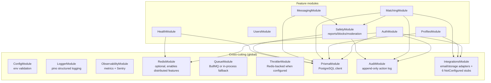
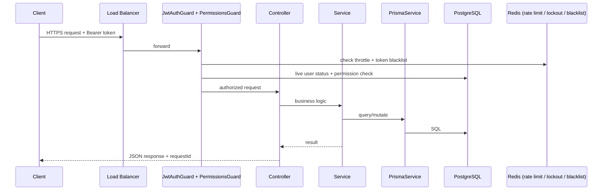

# Ember — Architecture Diagram

Full narrative and design rationale: `../ARCHITECTURE.md`. This is the same system,
visually — module list and request flow taken directly from `backend/src/app.module.ts`
and each feature module's actual imports, not idealized.

## Module structure

## Request flow

## Key design decisions this diagram encodes

- **Every route is protected by default** (`JwtAuthGuard` applied globally) — a route must
  opt out with `@Public()`, not opt in to protection.
- **Redis is optional** — every Redis-dependent feature (distributed throttling, account
  lockout, token blacklist, BullMQ queues) has a documented, tested fallback (in-memory /
  in-process) when `REDIS_URL` is unset, appropriate for local dev/CI, not production.
- **Six integration points are deliberate stubs** (`NotConfigured*Provider` for payments,
  SMS, identity verification, AI, push notifications, analytics) — the pattern is
  consistent and documented, not accidental gaps. Email and object storage are the two that
  graduated to real, tested adapters.
- **No feature module talks to another feature module's database tables directly** — cross-
  module interaction goes through the other module's service (e.g. `MatchingModule` calls
  `SafetyModule`'s `BlocksService`, not the `blocks` table directly).
