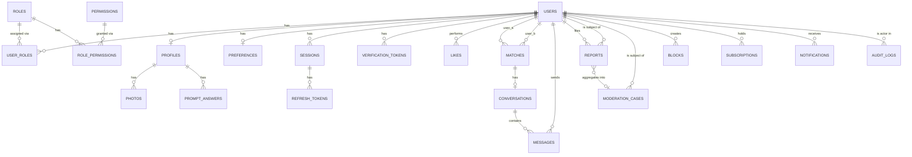

# Ember — Database Diagram

The real schema — matches `backend/prisma/schema.prisma` exactly (this diagram is the same
one in `../DATABASE_SCHEMA.md`, reproduced here for the release package; that document is
still the authoritative column-by-column reference).

## Notable design decisions this diagram encodes

- **RBAC is four join tables**, not a `role` column on `users` — `roles`/`permissions` are
  independently seeded (4 roles, 8 permissions), and a user's actual permissions are
  checked live against the database on every guarded request, never cached in a JWT.
- **Messages hang off a `conversations` table, not directly off `matches`** — every match
  has exactly one conversation; this extra hop isn't in the original planning document and
  is easy to miss if working from memory rather than the real schema.
- **`reports` and `moderation_cases` use `onDelete: Restrict`** on their user foreign keys,
  deliberately — a future account-deletion feature can't silently erase the safety trail by
  cascading a delete through it.
- **Not built yet** (real product needs, tracked in `../ROADMAP.md`, not represented above):
  identity-verification records, a dedicated device/login-event table (new-device
  detection is real but implemented via `sessions`, not a separate table), safety
  check-ins, trusted contacts, consent records, data-export/erasure request tracking.

Full column-by-column detail, including exact types, defaults, and indexes: `../DATABASE_SCHEMA.md`.
