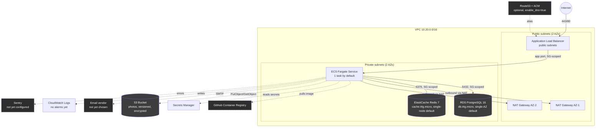

# Ember — Infrastructure Diagram

The AWS topology `infra/terraform/` describes — **infrastructure as code complete, never
applied to a real account** (see `../PRODUCTION_READINESS_REPORT.md`). Every resource named
below corresponds to a real Terraform resource, reviewed in `../TERRAFORM_READINESS.md` —
this is not an idealized/aspirational diagram.

Dashed boxes are either external services (GHCR, an email vendor) or optional/not-yet-real
components (Sentry, Route53/ACM) — solid boxes are what Terraform actually provisions
inside the AWS account.

## Security boundary summary

- The internet can reach **only** the ALB (port 80/443).
- The ECS service can be reached **only** from the ALB.
- RDS and Redis can be reached **only** from the ECS service — never directly from the
  internet, never from each other.
- Outbound internet access from the private subnets (image pulls, SMTP, S3, Sentry) goes
  through the NAT gateways — the ECS tasks themselves have no public IP.

## What's not yet real

- No CloudWatch alarms exist on any of this (logs are collected; nothing alerts on them —
  `../TERRAFORM_READINESS.md`'s top finding).
- No GitHub OIDC deploy role exists yet to let CI actually update the ECS service.
- The GHCR image pull requires either a public package or repository credentials not yet
  configured on the task definition.
- None of the above has ever been applied — this diagram describes a plan, not a deployed
  system. See `../PRODUCTION_READINESS_REPORT.md` for the explicit deployment status.
